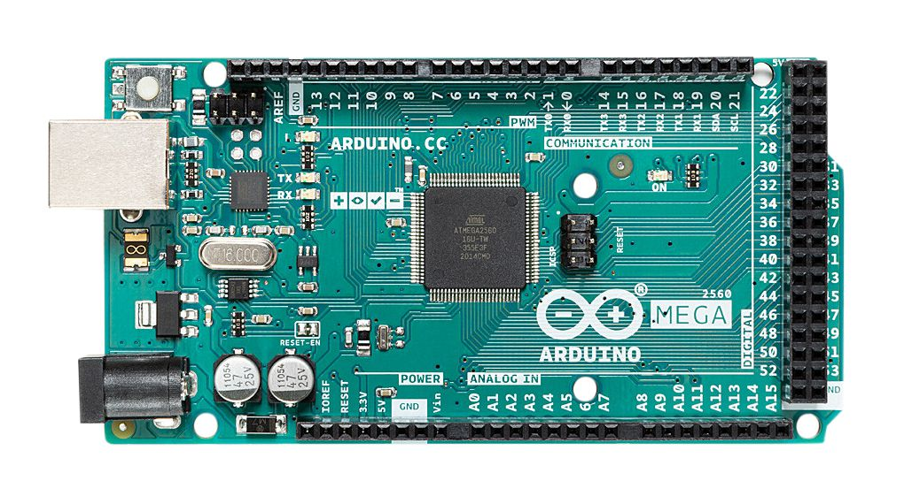
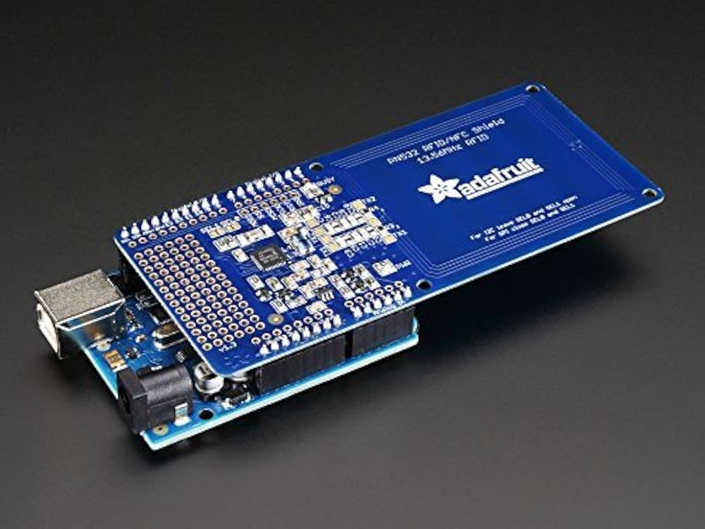
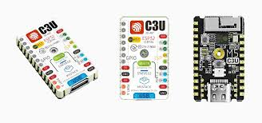
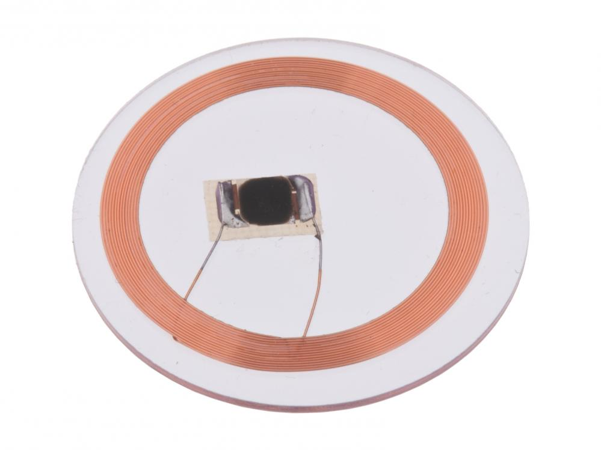
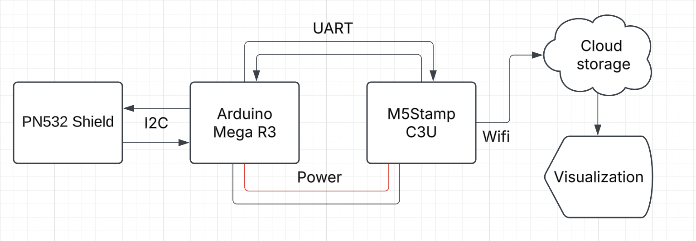

# iotlab-pilotcase-sensiot

Sensiot is aimed at counting the usage of drinking glasses in the school dining in order to estimate the number of people who have eaten there each day. Each tray holds 30 glasses and is tagged with a Mifare Classic RFID tag, which can be read by the system whenever a tray is placed within range of the reader. By combining the count of tray scans with the known number of glasses per tray, one can calculate the total number of glasses in circulation and thus approximate how many individuals are dining.

The project is built around an Arduino Mega R3 combined with an Adafruit PN532 RFID Shield for reading Mifare Classic tags at 13.56 MHz, and an M5Stamp C3U (ESP32) module for transmitting the collected data over Wi-Fi to a backend for storage and analysis.

---

# Table of contents
- [iotlab-pilotcase-sensiot](#iotlab-pilotcase-sensiot)
- [Table of contents](#table-of-contents)
- [Purpose](#purpose)
- [RFID](#rfid)
- [Software](#software)
  - [IDE used](#ide-used)
  - [How it works](#how-it-works)
- [Hardware](#hardware)
  - [Equipment used](#equipment-used)
- [Schematic](#schematic)
- [Results](#results)
- [Video](#video)

---

# Purpose

The objective of this pilot case is to determine, in near real-time, the number of meals served in the school. Since each tray includes a fixed number of glasses (30), tracking the circulation of these trays provides an efficient way to calculate usage without manual counting. Data on how many trays are in use can be sent to a central server, aiding in resource planning and helping the staff monitor daily volume and trends more accurately.

---

# RFID

Radio-Frequency Identification (RFID) is a contactless method for identifying and tracking tags attached to objects. The RFID system employed here operates at 13.56 MHz (a high-frequency band often conforming to the ISO/IEC 14443 standard) and uses Mifare Classic tags. The core principle involves the following:

1. The RFID reader (PN532 Shield) generates an electromagnetic field at 13.56 MHz.  
2. When a passive tag, such as a Mifare Classic, is within range, it draws power from this field to activate and exchange data with the reader.  
3. A unique identifier (UID) and possibly additional data stored on the tag can then be read and processed by the microcontroller (Arduino Mega).

This setup was chosen for its quick read times, ability to distinguish multiple unique tags, and ease of integration with the existing Arduino ecosystem.

---

# Writing to Mifare Classic tags

While Mifare Classic tags have a built-in UID, you may wish to store and update additional data blocks on the tag with a unique identifier for each tray. 
For instance, if some system logic relies on reading a custom block value, you can write data to a specific block using the PN532. Adding a tray to the system involves writing a identifier to block 4.

```cpp
void write_to_tag(uint8_t type, uint8_t uidLength, void *uid) {

  uint8_t success;

  if (uidLength == 4) {  // UID length indicates Mifare Classic
    // Authenticate block 4 (Block 4 of sector 1) with key A
    Serial.println(nfc.mifareclassic_AuthenticateBlock(uid, uidLength, 4, 0, keya));
    
    if (nfc.mifareclassic_AuthenticateBlock(uid, uidLength, 4, 0, keya)) {
      // Prepare data to write
      uint8_t data[16] = { 0x1 };
      // Write the data to block 4
      success = nfc.mifareclassic_WriteDataBlock(4, data);
      if (success) {
        Serial.println("Data written to tag successfully!");
      } else {
        Serial.println("Failed to write to the card.");
      }
    } else {
      Serial.println("Authentication failed.");
    }
  }
}
```

Details:
• Mifare Classic tags are organized into sectors and blocks. Each block can hold 16 bytes of data.  
• In this example, block 4 is used to store the identifier (0x01), and the rest of the 16-byte array is initialized to zero.  
• The built-in UID of the Mifare tag remains unchanged. Instead, you are writing a custom identifier to one of the tag’s data blocks.  
• Each tray tag can thus be uniquely designated by setting different hex values (e.g., 0x01, 0x02, 0x03, etc.) for different trays.  

NB! For production use, ensure you have correct sector keys for reading and writing Mifare Classic tags, and consider securing the tags if unauthorized changes are a concern.

# Software

## How it works
1. The Arduino Mega, equipped with the PN532 RFID Shield, continuously polls for an RFID tag (i.e., a tray’s Mifare Classic tag).  
2. Whenever a tag is detected, a unique identifier (and possibly relevant metadata) is read, and the local tray count is updated.  
3. The Arduino then sends this updated tray count via UART to the M5Stamp C3U.  
4. The M5Stamp C3U, connected to a Wi-Fi network, relays the count to a backend service (for example, through an HTTP POST request).  
5. A backend or local web application processes these counts to give staff real-time feedback on how many trays/glasses are currently in use.

---

# Hardware

## Equipment used

| Equipment                             | Component Image                                                                      | Reference                                                                                                                                     | Function                                                                                                                                                                      |
| ------------------------------------- | ------------------------------------------------------------------------------------- | --------------------------------------------------------------------------------------------------------------------------------------------- | ----------------------------------------------------------------------------------------------------------------------------------------------------------------------------- |
| Arduino Mega R3                       |                            | [Arduino Mega R3](https://store.arduino.cc/products/arduino-mega-2560-rev3)                                                                   | Main microcontroller responsible for interfacing with the RFID shield, reading tag data, and sending Serial messages to the M5Stamp C3U.                                      |
| Adafruit PN532 RFID Shield            |                            | [Adafruit PN532](https://www.adafruit.com/product/789)                                                                                       | High-frequency (13.56 MHz) RFID reader capable of reading Mifare Classic and various other tag types; mounts directly on the Arduino Mega or is wired via SPI/Serial.        |
| M5Stamp C3U (ESP32)                   |                             | [M5Stamp C3U]()                                                                                    | Compact Wi-Fi enabled microcontroller (ESP32 based) that receives tray-count updates from the Arduino and forwards them to a backend server over a wireless network.         |
| Mifare Classic RFID tags              |                               | [Mifare Classic Tags](https://www.nxp.com/products/rfid-nfc/mifare-classic)                                                                   | Passive tags operating at 13.56 MHz, affixed to trays (which hold 30 glasses) so that glass usage can be tracked by detecting the presence of these tags.                    |

---

# Schematic

Below is an overview illustrating how the components interconnect:

<p align="center">
  
</p>

1. The PN532 Shield can stack directly onto the Arduino Mega or be wired through SPI/Serial pins.  
2. The Arduino Mega sends tray count data to the M5Stamp C3U via UART (TX → RX, RX → TX).  
3. The M5Stamp C3U connects to a Wi-Fi network and sends the data to an external endpoint for storage and analysis.

---

# Results

Once assembled, each tray displaying a valid Mifare Classic tag triggers an increment in the count registered by the Arduino Mega when brought near the PN532 reader. The tray count is then transferred to the M5Stamp C3U and ultimately to a backend server. By tracking the number of trays in circulation (and correlating each tray with 30 glasses), it is possible to derive how many glasses are being used during a given day, thereby providing an approximate measure of the number of people dining at the school.

---

               


# Video
Demonstration:

<p align="center">
  <video width="640" height="360" controls>
    <source src="videos/myvideo.mp4" type="video/mp4">
    Your browser does not support the video tag.
  </video>
</p>
